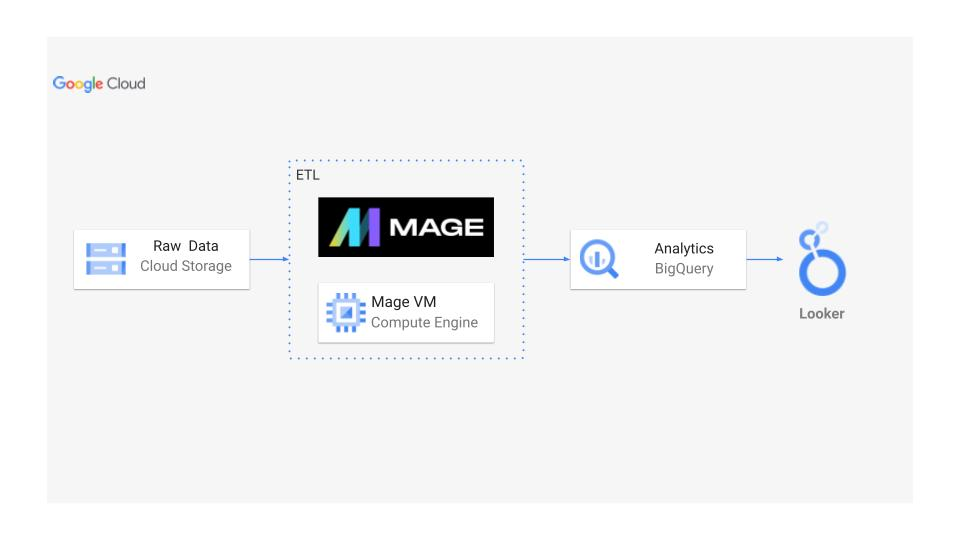
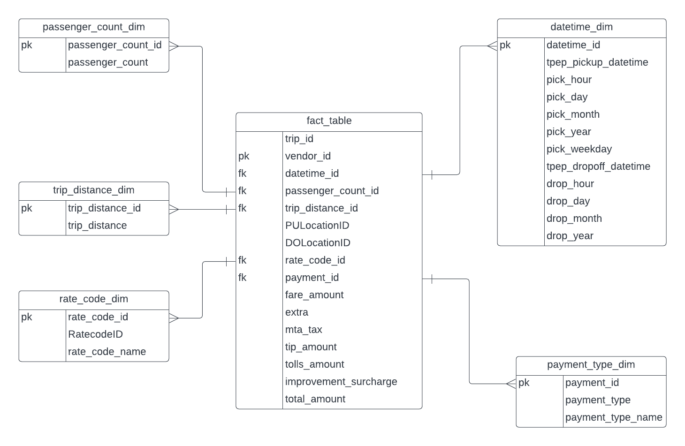

# NYC-TLC-Trip | Data Engineering Project

Report can be found here :-: https://lookerstudio.google.com/reporting/a397d09c-acb4-4951-91e8-d90d3658420f

## Dataset Used
NYC TLC Trip Record Data
-> NYC TLC Trip data for October 2023 was used for this project.
The data can be gathered from - https://www.nyc.gov/site/tlc/about/tlc-trip-record-data.page

The data dictonary for the dataset can be found here - https://www.nyc.gov/assets/tlc/downloads/pdf/data_dictionary_trip_records_yellow.pdf

## Architecture


## Programming Languages
1. Python
2. SQL

## Google Cloud Platform
1. Google Storage
2. Compute Instance 
3. BigQuery
4. Looker Studio
5. Data Pipeine Tool - https://www.mage.ai/
``` shell
pip install mage-ai
```

>[!NOTE]
>The dataset used here has so many data entries, more than 300,000 to be precise. Therefore I have only used the first 100,000 data entries for the project.

>[!WARNING]
>I have installed python, mage-ai on my local system as the data size was huge and I didnt want to use any cloud service due to the same reason.

>[!IMPORTANT]
>As this is a local system project:- 
>  1. I have uploaded the dataset to github
>  2. I have a data-loader script which downloads the dataset
>  3. Then apply some transformations from the transformations script
>  4. Load it in using BigQuery
>  5. At last use Looker Studio to make an interactive dashboard

## Data Model

